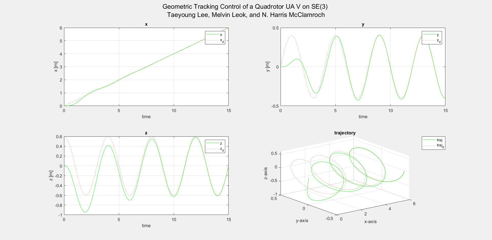
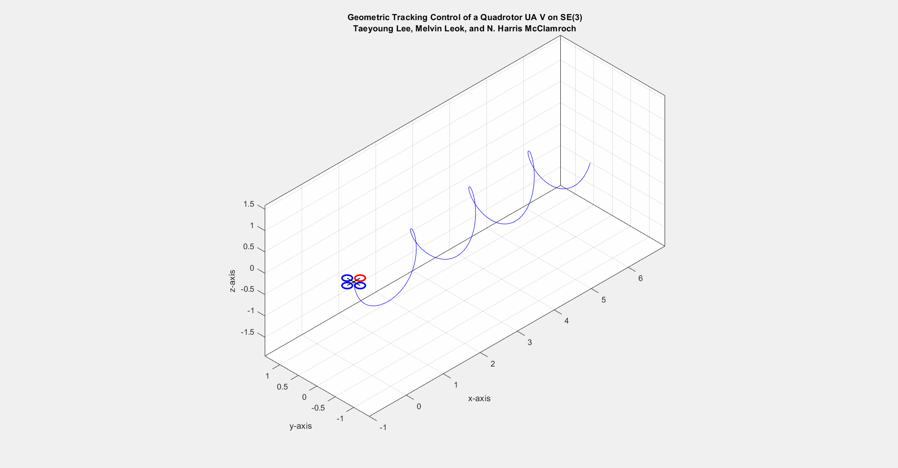

# Matlab simulation and implementation of Geometric control of Quadrotor on SE(3) 
*Koushil Sreenath, Taeyoung Lee, Vijay Kumar*

[Paper][http://www.math.ucsd.edu/~mleok/pdf/LeLeMc2010_quadrotor.pdf]


#Plots




## Download Instructions

- In Terminal,
  ```
  git clone git@github.com:vkotaru/quad_geometric_control.git
  ```
  
  ```
  git submodule update --init --recursive
  ```
  
 https://github.com/vkotaru/quad_geometric_control